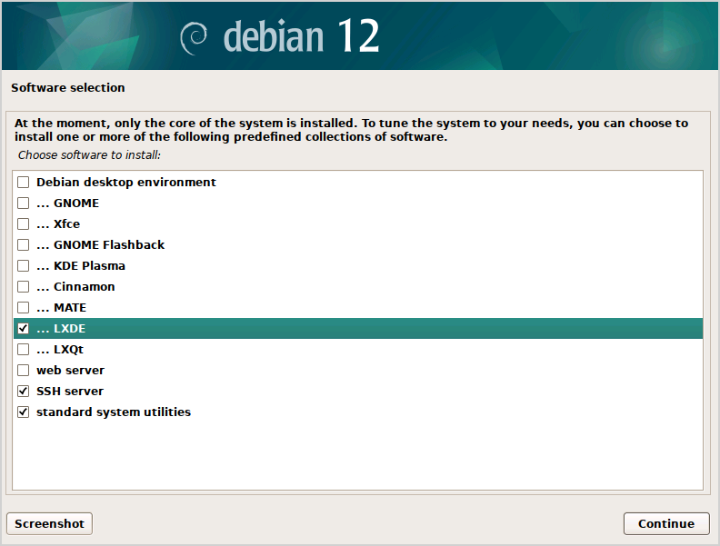

# 🖥️ Kiosk Setup Script

This script automates the process of turning a Debian-based Linux system into a **Chromium-based kiosk**. It installs the necessary packages, enables auto-login, configures LXDE to launch Chromium in kiosk mode, and optionally disables keyboard and mouse inputs for full lock-down.

---

## 📦 Features

- Installs required packages (LXDE, Chromium, LightDM, etc.)
- Enables auto-login using LightDM
- Launches Chromium in full-screen kiosk mode on boot
- Disables keyboard and mouse via udev rules (optional)
- Enables SSH for remote management
- Includes logging to `/var/log/kiosk-setup.log`
- Clean, modular design with function-based structure

---

## ⚠️ Warning

> **This script disables keyboard and mouse access** after reboot.  
> You must use SSH to access the system for further configuration.

---

## ✅ Requirements

- A Debian system (tested on Debian; other Debian-based distros may work)
- Minimal installation with:
  - **LXDE desktop environment**
  - **OpenSSH server**
  - **Standard system utilities**
- A user account to run the kiosk session
- Internet access to install additional packages

> 💡 Using a lightweight desktop like LXDE ensures faster performance and lower resource usage, ideal for kiosk deployments.



---

## 🛠️ Usage

1. **Clone or Download** this repository:

   ```bash
   git clone https://github.com/0xdolan/kiosk-setup.git
   cd kiosk-setup
   ```

2. **Make the script executable**:

   ```bash
   chmod +x kiosk-setup.sh
   ```

3. **Run the script as root**:

   ```bash
   sudo ./kiosk-setup.sh
   ```

4. **Follow the prompts**:

   - Enter the username for the kiosk session
   - Enter the URL to be opened in kiosk mode

5. **Choose to reboot when prompted** or do so manually:
   ```bash
   sudo reboot
   ```

---

## 🔐 SSH Access

After setup, SSH is enabled. You can connect to the system with:

```bash
ssh <kiosk-user>@<device-ip>
```

Use `hostname -I` on the kiosk machine to find its IP.

---

## 📁 File Structure

```bash
kiosk-setup/
├── kiosk-setup.sh
└── README.md
```

---

## 🧹 To Undo / Reset

- Restore `/etc/lightdm/lightdm.conf` from the `.bak.*` backup
- Delete `/etc/systemd/system/kiosk.service`
- Remove `/etc/udev/rules.d/99-disable-input.rules`
- Re-enable keyboard/mouse:
  ```bash
  sudo chmod 644 /dev/input/event*
  ```
